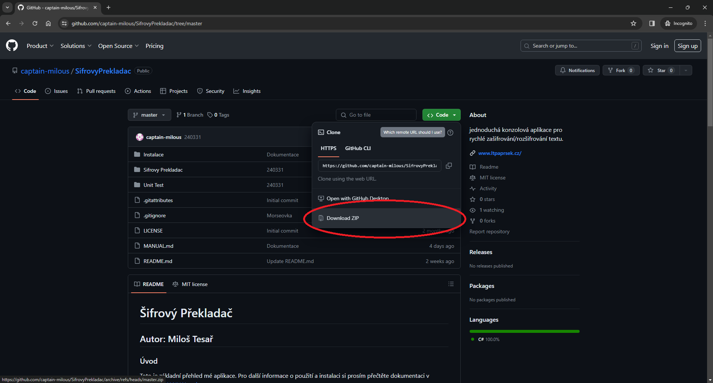

## 1. Nainstalujte [DOTNET](https://dotnet.microsoft.com/en-us/download/dotnet/7.0/runtime)

## 2. Stáhněte si z repositáře [ZIP](https://github.com/captain-milous/SifrovyPrekladac.git) 

## 3. Extrahujte zip do vámi zvoleného adresáře

## 4. Nakonfigurujte si aplikaci v konfiguračním souboru

Cesta ke konfiguračnímu souboru: *VAS_ZVOLENY_ADRESAR\\SifrovyPrekladac\\Sifrovy Prekladac\\bin\\Debug\\net7.0\\config.xml*

## 5. Spustit aplikaci

Cesta ke spuštění: *VAS_ZVOLENY_ADRESAR\\SifrovyPrekladac\\Sifrovy Prekladac\\bin\\Debug\\net7.0\\SifrovyPrekladac.exe*